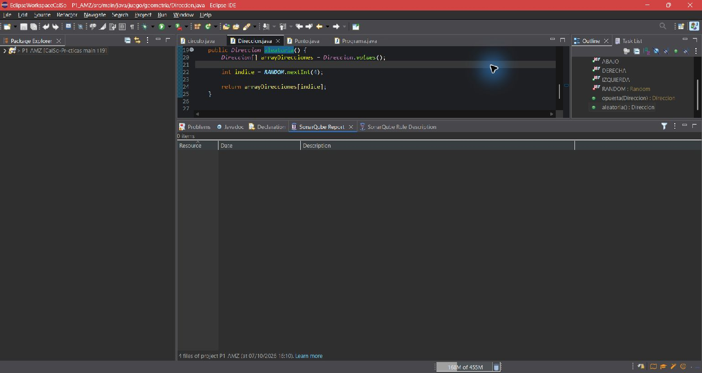

# Práctica 1 — Revisión estática de código con SonarQube for Eclipse

## 1. Miembros del grupo

| Miembro | Nombre y apellidos |
|---|---|
| Alumno 1 | Adrián Martínez Zamora |
| Alumno 2 | Sin incorporar; trabajo individual por ahora |

**Nombre provisional del proyecto Eclipse:** `P1_AMZ`

El enunciado exige dos integrantes y commits propios de ambos. Como todavía no hay segundo integrante, ese requisito de la entrega queda pendiente de acordar con el profesorado. Si se incorpora otra persona, habrá que adaptar el nombre del proyecto y las evidencias para que las dos capturas y la carpeta del proyecto coincidan.

## 2. Análisis inicial

El 7 de octubre de 2026 se analizó el proyecto completo `P1_AMZ` con SonarQube for IDE 13.0 en Eclipse, en modo local independiente y con las reglas predeterminadas. Se detectaron **23 disconformidades** en cuatro archivos, antes de modificar el código Java.

## 3. Disconformidades detectadas

La tabla reproduce los avisos del análisis inicial. Las líneas corresponden al código original; pueden cambiar tras las correcciones.

| Nº | Regla Sonar | Archivo | Línea | Disconformidad |
|---:|---|---|---:|---|
| 1 | `java:S2119` | `Direccion.java` | 21 | Save and re-use this "Random". |
| 2 | `java:S1197` | `Direccion.java` | 19 | Move the array designators `[]` to the type. |
| 3 | `java:S106` | `Programa.java` | 20 | Replace this use of `System.out` by a logger. |
| 4 | `java:S2201` | `Programa.java` | 16 | The return value of `concat` must be used. |
| 5 | `java:S1197` | `Programa.java` | 10 | Move the array designators `[]` to the type. |
| 6 | `java:S1197` | `Programa.java` | 7 | Move the array designators `[]` to the type. |
| 7 | `java:S4973` | `Programa.java` | 18 | Strings and boxed types should be compared using `equals()`. |
| 8 | `java:S1128` | `Punto.java` | 4 | Remove this unused import `java.util.Random`. |
| 9 | `java:S2225` | `Punto.java` | 145 | Return a non null object. |
| 10 | `java:S108` | `Punto.java` | 143 | Remove this block of code, fill it in, or add a comment explaining why it is empty. |
| 11 | `java:S2975` | `Punto.java` | 136 | Remove this `clone` implementation; use a copy constructor or copy factory instead. |
| 12 | `java:S1905` | `Punto.java` | 130 | Remove this unnecessary cast to `Punto`. |
| 13 | `java:S1201` | `Punto.java` | 126 | Either override `Object.equals(Object)`, or rename the method to prevent any confusion. |
| 14 | `java:S100` | `Punto.java` | 82 | Rename the method to match `^[a-z][a-zA-Z0-9]*$`. |
| 15 | `java:S100` | `Punto.java` | 51 | Rename the method to match `^[a-z][a-zA-Z0-9]*$`. |
| 16 | `java:S1124` | `Punto.java` | 11 | Reorder the modifiers to comply with the Java Language Specification. |
| 17 | `java:S115` | `Punto.java` | 11 | Rename the constant to match `^[A-Z][A-Z0-9]*(_[A-Z0-9]+)*$`. |
| 18 | `java:S1128` | `Punto.java` | 3 | Remove this unnecessary import: `java.lang` classes are always implicitly imported. |
| 19 | `java:S1144` | `Punto.java` | 116 | Remove this unused private `distancia` method. |
| 20 | `java:S2184` | `Punto.java` | 117 | Cast one operand of the subtraction to `double` (coordinate X). |
| 21 | `java:S2184` | `Punto.java` | 117 | Cast one operand of the subtraction to `double` (coordinate Y). |
| 22 | `java:S1172` | `circulo.java` | 10 | Remove this unused method parameter `centroIni`. |
| 23 | `java:S101` | `circulo.java` | 3 | Rename this class to match `^[A-Z][a-zA-Z0-9]*$`. |

## 4. Soluciones adoptadas

### Disconformidad 1 — `java:S2119`

**Localización inicial:** `src/main/java/juego/geometria/Direccion.java`, línea 21.  
**Responsable:** Adrián Martínez Zamora.  
**Commit:** [da24fab](https://github.com/adrimmz04/CalSo-Pr-cticas/commit/da24fab7672fb45a973af7fb6105a0bccd231fea).

**Problema detectado.** `aleatoria()` creaba un `Random` nuevo en cada llamada, con un coste innecesario y una secuencia potencialmente menos aleatoria.

**Solución adoptada.** Se creó una única instancia `private static final Random RANDOM` en `Direccion` y el método la reutiliza. El nuevo análisis del proyecto completo mostró 22 incidencias: desapareció `java:S2119` y no aparecieron otras nuevas.

### Disconformidad 2 — `java:S1197`

**Localización inicial:** `src/main/java/juego/geometria/Direccion.java`, línea 19.  
**Responsable:** Adrián Martínez Zamora.  
**Commit:** [36044de](https://github.com/adrimmz04/CalSo-Pr-cticas/commit/36044dec2aedebd402cf98336e3e7f7081731ce6).

**Problema detectado.** Los corchetes del arreglo estaban junto al nombre `arrayDirecciones` en lugar de junto al tipo.

**Solución adoptada.** Se cambió la declaración a `Direccion[] arrayDirecciones`. El nuevo análisis del proyecto completo mostró 21 incidencias: desapareció este aviso y no aparecieron otros nuevos.

### Disconformidad 3 — `java:S106`

**Localización inicial:** `src/main/java/juego/pruebas/Programa.java`, línea 20.  
**Responsable:** Adrián Martínez Zamora.  
**Commit:** [886e2de](https://github.com/adrimmz04/CalSo-Pr-cticas/commit/886e2def0f3fc2428e92a9f643ab4b200fd71ceb).

**Problema detectado.** El programa escribía directamente en `System.out`, sin el control de niveles y destinos que ofrece un registrador.

**Solución adoptada.** Se incorporó un `Logger` de `java.util.logging` y se sustituyó `System.out.println(mensaje)` por `LOGGER.info(mensaje)`. El análisis completo mostró 20 incidencias, sin avisos nuevos.

### Disconformidad 4 — `java:S2201`

**Localización inicial:** `src/main/java/juego/pruebas/Programa.java`, línea 16.  
**Responsable:** Adrián Martínez Zamora.  
**Commit:** [17fa9a3](https://github.com/adrimmz04/CalSo-Pr-cticas/commit/17fa9a32d5c3eb000a2378721cebc4c605db5869).

**Problema detectado.** `String.concat` devuelve una cadena nueva, pero el código descartaba ese resultado. Además, el arreglo tenía una posición `null` que produciría una excepción al recorrerlo.

**Solución adoptada.** Se asigna el resultado a `info` y se ignoran los elementos `null` del arreglo antes de llamar a `toString()`. El análisis completo mostró 19 incidencias, sin avisos nuevos.

### Disconformidad 5 — `java:S1197`

**Localización inicial:** `src/main/java/juego/pruebas/Programa.java`, línea 10.  
**Responsable:** Adrián Martínez Zamora.  
**Commit:** [1c4cd3b](https://github.com/adrimmz04/CalSo-Pr-cticas/commit/1c4cd3be4b7a63ca5476fe59940aeb852eb9cba2).

**Problema detectado.** Los corchetes del arreglo estaban junto al nombre `puntos`.

**Solución adoptada.** Se declaró `Punto[] puntos`. El análisis completo mostró 18 incidencias, sin avisos nuevos.

### Disconformidad 6 — `java:S1197`

**Localización inicial:** `src/main/java/juego/pruebas/Programa.java`, línea 7.  
**Responsable:** Adrián Martínez Zamora.  
**Commit:** [7aabe61](https://github.com/adrimmz04/CalSo-Pr-cticas/commit/7aabe612dc78fbfddff894a7350f90c353608951).

**Problema detectado.** `main` declaraba los argumentos como `String args[]`, con los corchetes junto al nombre de la variable.

**Solución adoptada.** Se cambió la firma a `main(String[] args)`. El análisis completo mostró 17 incidencias, sin avisos nuevos.

### Disconformidad 7 — `java:S4973`

**Localización inicial:** `src/main/java/juego/pruebas/Programa.java`, línea 18.  
**Responsable:** Adrián Martínez Zamora.  
**Commit:** [74d809c](https://github.com/adrimmz04/CalSo-Pr-cticas/commit/74d809c473a64359a3a3067e9e9681e948d05112).

**Problema detectado.** `info == ""` comparaba referencias de objetos, no el contenido de la cadena.

**Solución adoptada.** Se utilizó `info.isEmpty()`, que expresa directamente la condición buscada. El análisis completo mostró 16 incidencias, sin avisos nuevos.

### Disconformidad 8 — `java:S1128`

**Localización inicial:** `src/main/java/juego/geometria/Punto.java`, línea 4.  
**Responsable:** Adrián Martínez Zamora.  
**Commit:** [41a6d12](https://github.com/adrimmz04/CalSo-Pr-cticas/commit/41a6d126e2020898f69efb9570163dedeb07562f).

**Problema detectado.** `Punto` importaba `java.util.Random` sin utilizarlo.

**Solución adoptada.** Se eliminó esa importación. El análisis completo mostró 15 incidencias, sin avisos nuevos.

### Disconformidad 9 — `java:S2225`

**Localización inicial:** `src/main/java/juego/geometria/Punto.java`, línea 145.  
**Responsable:** Adrián Martínez Zamora.  
**Commit:** [01a8990](https://github.com/adrimmz04/CalSo-Pr-cticas/commit/01a89902fc3b09303af068823a16365daf63758f).

**Problema detectado.** `clone()` podía devolver `null`, en contra de lo esperado para un método de copia.

**Solución adoptada.** Se eliminó el método `clone()` defectuoso. La clase ya ofrece `Punto(Punto otra)` para crear copias. No había llamadas a `clone()` en el proyecto.

### Disconformidad 10 — `java:S108`

**Localización inicial:** `src/main/java/juego/geometria/Punto.java`, línea 143.  
**Responsable:** Adrián Martínez Zamora.  
**Commit:** [01a8990](https://github.com/adrimmz04/CalSo-Pr-cticas/commit/01a89902fc3b09303af068823a16365daf63758f).

**Problema detectado.** El `catch (CloneNotSupportedException e)` estaba vacío y ocultaba el fallo.

**Solución adoptada.** La eliminación del mismo `clone()` quitó el bloque vacío. Es la misma modificación atómica que resuelve las disconformidades 9 y 11.

### Disconformidad 11 — `java:S2975`

**Localización inicial:** `src/main/java/juego/geometria/Punto.java`, línea 136.  
**Responsable:** Adrián Martínez Zamora.  
**Commit:** [01a8990](https://github.com/adrimmz04/CalSo-Pr-cticas/commit/01a89902fc3b09303af068823a16365daf63758f).

**Problema detectado.** Una clase inmutable con constructor de copia implementaba un `clone()` basado en `super.clone()` pese a no admitir esa operación correctamente.

**Solución adoptada.** Se conservó el constructor de copia y se retiró `clone()` completo. El análisis del proyecto pasó de 15 a 12 incidencias, sin avisos nuevos. Las tres disconformidades procedían del mismo método y desaparecieron juntas.

### Disconformidad 12 — `java:S1905`

**Localización inicial:** `src/main/java/juego/geometria/Punto.java`, línea 130.  
**Responsable:** Adrián Martínez Zamora.  
**Commit:** [86bc41e](https://github.com/adrimmz04/CalSo-Pr-cticas/commit/86bc41eef0f61aa108846a89c70be5733fa6f931).

**Problema detectado.** El parámetro de `equals(Punto)` ya era un `Punto`, por lo que convertirlo de nuevo a ese tipo no tenía efecto.

**Solución adoptada.** Se asignó `obj` directamente a `other`. El análisis completo mostró 11 incidencias, sin avisos nuevos. La firma de `equals` se corrige por separado en la disconformidad 13.

### Disconformidad 13 — `java:S1201`

**Localización inicial:** `src/main/java/juego/geometria/Punto.java`, línea 126.  
**Responsable:** Adrián Martínez Zamora.  
**Commit:** [ca71627](https://github.com/adrimmz04/CalSo-Pr-cticas/commit/ca71627a99879906cec9a881b106276d3787146b).

**Problema detectado.** `equals(Punto)` no sobrescribía `Object.equals(Object)` y podía dar resultados distintos según el tipo estático de la referencia.

**Solución adoptada.** Se sobrescribió `equals(Object)`, se comprobó el tipo de forma segura y se añadió un `hashCode()` coherente con las coordenadas comparadas. El análisis completo mostró 10 incidencias, sin avisos nuevos.

### Disconformidad 14 — `java:S100`

**Localización inicial:** `src/main/java/juego/geometria/Punto.java`, línea 82.  
**Responsable:** Adrián Martínez Zamora.  
**Commit:** [e956ab7](https://github.com/adrimmz04/CalSo-Pr-cticas/commit/e956ab708a40fec6c3af0f0f637351a566be8b2d).

**Problema detectado.** El nombre `situacion_relativa` no seguía la convención de nombres de métodos Java.

**Solución adoptada.** Se renombró a `situacionRelativa`; no existían llamadas que actualizar. El análisis completo mostró 9 incidencias, sin avisos nuevos.

### Disconformidad 15 — `java:S100`

**Localización inicial:** `src/main/java/juego/geometria/Punto.java`, línea 51.  
**Responsable:** Adrián Martínez Zamora.  
**Commit:** [aa46c04](https://github.com/adrimmz04/CalSo-Pr-cticas/commit/aa46c0462d0f819d14c353d2f6c5ccd1706953be).

**Problema detectado.** El método `Adyacente` comenzaba con mayúscula y no seguía la convención de nombres de métodos Java.

**Solución adoptada.** Se renombró a `adyacente` y se actualizó su llamada desde `isAdyacente`. El análisis completo mostró 8 incidencias, sin avisos nuevos.

### Disconformidad 16 — `java:S1124`

**Localización inicial:** `src/main/java/juego/geometria/Punto.java`, línea 11.  
**Responsable:** Adrián Martínez Zamora.  
**Commit:** [5d63bcf](https://github.com/adrimmz04/CalSo-Pr-cticas/commit/5d63bcf4eea3b767e639b89c7e8ee6cbd39977f5).

**Problema detectado.** La declaración de `defaultValue` usaba `public final static`, fuera del orden habitual de Java.

**Solución adoptada.** Se cambió a `public static final`. El análisis completo mostró 7 incidencias, sin avisos nuevos.

### Disconformidad 17 — `java:S115`

**Localización inicial:** `src/main/java/juego/geometria/Punto.java`, línea 11.  
**Responsable:** Adrián Martínez Zamora.  
**Commit:** [d2ae809](https://github.com/adrimmz04/CalSo-Pr-cticas/commit/d2ae8097d7334965172f595731e548f843f5eb8b).

**Problema detectado.** La constante pública `defaultValue` no estaba escrita en mayúsculas con guiones bajos.

**Solución adoptada.** Se renombró a `DEFAULT_VALUE`; no había referencias internas que actualizar. El análisis completo mostró 6 incidencias, sin avisos nuevos.

### Disconformidad 18 — `java:S1128`

**Localización inicial:** `src/main/java/juego/geometria/Punto.java`, línea 3.  
**Responsable:** Adrián Martínez Zamora.  
**Commit:** [806a0c1](https://github.com/adrimmz04/CalSo-Pr-cticas/commit/806a0c1776b20dae47ad8b1338f9c3a22e0ce0c5).

**Problema detectado.** Se importaba `java.lang.Math`, aunque los tipos de `java.lang` se importan implícitamente.

**Solución adoptada.** Se eliminó la línea de importación sin cambiar las llamadas a `Math`. El análisis completo mostró 5 incidencias, sin avisos nuevos.

### Disconformidad 19 — `java:S1144`

**Localización inicial:** `src/main/java/juego/geometria/Punto.java`, línea 116.  
**Responsable:** Adrián Martínez Zamora.  
**Commit:** [ee79cdf](https://github.com/adrimmz04/CalSo-Pr-cticas/commit/ee79cdfc46f874601138bcf751585be154db89d1).

**Problema detectado.** `distancia` era un método privado sin llamadas en el proyecto.

**Solución adoptada.** Se eliminó el método completo. El enunciado admite retirar código muerto cuando esa es la causa de la disconformidad.

### Disconformidad 20 — `java:S2184`

**Localización inicial:** `src/main/java/juego/geometria/Punto.java`, línea 117, resta de coordenadas X.  
**Responsable:** Adrián Martínez Zamora.  
**Commit:** [ee79cdf](https://github.com/adrimmz04/CalSo-Pr-cticas/commit/ee79cdfc46f874601138bcf751585be154db89d1).

**Problema detectado.** La resta de enteros se efectuaba antes de convertir el resultado a `double`, con posibilidad de desbordamiento.

**Solución adoptada.** La expresión desapareció al retirar `distancia`, que no se utilizaba. No se mantuvo una operación defectuosa dentro de código muerto.

### Disconformidad 21 — `java:S2184`

**Localización inicial:** `src/main/java/juego/geometria/Punto.java`, línea 117, resta de coordenadas Y.  
**Responsable:** Adrián Martínez Zamora.  
**Commit:** [ee79cdf](https://github.com/adrimmz04/CalSo-Pr-cticas/commit/ee79cdfc46f874601138bcf751585be154db89d1).

**Problema detectado.** La segunda resta de enteros tenía el mismo riesgo de desbordamiento.

**Solución adoptada.** Ambas restas pertenecían exclusivamente al método privado sin uso. Su eliminación atómica resolvió las disconformidades 19, 20 y 21. El análisis completo pasó de 5 a 2 incidencias, sin avisos nuevos.

### Disconformidad 22 — `java:S1172`

**Localización inicial:** `src/main/java/juego/geometria/circulo.java`, línea 10.  
**Responsable:** Adrián Martínez Zamora.  
**Commit:** [19a4d5b](https://github.com/adrimmz04/CalSo-Pr-cticas/commit/19a4d5bd05b434c5af7ea8bfa98cf4662d7933d2).

**Problema detectado.** El constructor recibía `centroIni` pero no lo almacenaba; `centro` quedaba en `null` y podía fallar al consultar o desplazar el círculo.

**Solución adoptada.** Se inicializa `centro` con una copia defensiva de `centroIni`. El análisis completo mostró una sola incidencia, sin avisos nuevos.

### Disconformidad 23 — `java:S101`

**Localización inicial:** `src/main/java/juego/geometria/circulo.java`, línea 3.  
**Responsable:** Adrián Martínez Zamora.  
**Commit:** [f3dc5b9](https://github.com/adrimmz04/CalSo-Pr-cticas/commit/f3dc5b9f4cbc6bbc74047144c90356000e22cfaa).

**Problema detectado.** La clase pública `circulo` empezaba con minúscula y no seguía la convención de nombres de clases Java.

**Solución adoptada.** Se renombraron la clase, el archivo y ambos constructores a `Circulo`. El análisis completo del mismo proyecto `P1_AMZ` mostró **0 incidencias**.

## 5. Resumen de las correcciones

| Nº | Regla Sonar | Responsable | Commit | Resultado |
|---:|---|---|---|---|
| 1 | `java:S2119` | Adrián Martínez Zamora | [da24fab](https://github.com/adrimmz04/CalSo-Pr-cticas/commit/da24fab7672fb45a973af7fb6105a0bccd231fea) | Resuelta; 23 → 22 incidencias |
| 2 | `java:S1197` | Adrián Martínez Zamora | [36044de](https://github.com/adrimmz04/CalSo-Pr-cticas/commit/36044dec2aedebd402cf98336e3e7f7081731ce6) | Resuelta; 22 → 21 incidencias |
| 3 | `java:S106` | Adrián Martínez Zamora | [886e2de](https://github.com/adrimmz04/CalSo-Pr-cticas/commit/886e2def0f3fc2428e92a9f643ab4b200fd71ceb) | Resuelta; 21 → 20 incidencias |
| 4 | `java:S2201` | Adrián Martínez Zamora | [17fa9a3](https://github.com/adrimmz04/CalSo-Pr-cticas/commit/17fa9a32d5c3eb000a2378721cebc4c605db5869) | Resuelta; 20 → 19 incidencias |
| 5 | `java:S1197` | Adrián Martínez Zamora | [1c4cd3b](https://github.com/adrimmz04/CalSo-Pr-cticas/commit/1c4cd3be4b7a63ca5476fe59940aeb852eb9cba2) | Resuelta; 19 → 18 incidencias |
| 6 | `java:S1197` | Adrián Martínez Zamora | [7aabe61](https://github.com/adrimmz04/CalSo-Pr-cticas/commit/7aabe612dc78fbfddff894a7350f90c353608951) | Resuelta; 18 → 17 incidencias |
| 7 | `java:S4973` | Adrián Martínez Zamora | [74d809c](https://github.com/adrimmz04/CalSo-Pr-cticas/commit/74d809c473a64359a3a3067e9e9681e948d05112) | Resuelta; 17 → 16 incidencias |
| 8 | `java:S1128` | Adrián Martínez Zamora | [41a6d12](https://github.com/adrimmz04/CalSo-Pr-cticas/commit/41a6d126e2020898f69efb9570163dedeb07562f) | Resuelta; 16 → 15 incidencias |
| 9 | `java:S2225` | Adrián Martínez Zamora | [01a8990](https://github.com/adrimmz04/CalSo-Pr-cticas/commit/01a89902fc3b09303af068823a16365daf63758f) | Resuelta; junto con 10 y 11 |
| 10 | `java:S108` | Adrián Martínez Zamora | [01a8990](https://github.com/adrimmz04/CalSo-Pr-cticas/commit/01a89902fc3b09303af068823a16365daf63758f) | Resuelta; junto con 9 y 11 |
| 11 | `java:S2975` | Adrián Martínez Zamora | [01a8990](https://github.com/adrimmz04/CalSo-Pr-cticas/commit/01a89902fc3b09303af068823a16365daf63758f) | Resuelta; 15 → 12 incidencias |
| 12 | `java:S1905` | Adrián Martínez Zamora | [86bc41e](https://github.com/adrimmz04/CalSo-Pr-cticas/commit/86bc41eef0f61aa108846a89c70be5733fa6f931) | Resuelta; 12 → 11 incidencias |
| 13 | `java:S1201` | Adrián Martínez Zamora | [ca71627](https://github.com/adrimmz04/CalSo-Pr-cticas/commit/ca71627a99879906cec9a881b106276d3787146b) | Resuelta; 11 → 10 incidencias |
| 14 | `java:S100` | Adrián Martínez Zamora | [e956ab7](https://github.com/adrimmz04/CalSo-Pr-cticas/commit/e956ab708a40fec6c3af0f0f637351a566be8b2d) | Resuelta; 10 → 9 incidencias |
| 15 | `java:S100` | Adrián Martínez Zamora | [aa46c04](https://github.com/adrimmz04/CalSo-Pr-cticas/commit/aa46c0462d0f819d14c353d2f6c5ccd1706953be) | Resuelta; 9 → 8 incidencias |
| 16 | `java:S1124` | Adrián Martínez Zamora | [5d63bcf](https://github.com/adrimmz04/CalSo-Pr-cticas/commit/5d63bcf4eea3b767e639b89c7e8ee6cbd39977f5) | Resuelta; 8 → 7 incidencias |
| 17 | `java:S115` | Adrián Martínez Zamora | [d2ae809](https://github.com/adrimmz04/CalSo-Pr-cticas/commit/d2ae8097d7334965172f595731e548f843f5eb8b) | Resuelta; 7 → 6 incidencias |
| 18 | `java:S1128` | Adrián Martínez Zamora | [806a0c1](https://github.com/adrimmz04/CalSo-Pr-cticas/commit/806a0c1776b20dae47ad8b1338f9c3a22e0ce0c5) | Resuelta; 6 → 5 incidencias |
| 19 | `java:S1144` | Adrián Martínez Zamora | [ee79cdf](https://github.com/adrimmz04/CalSo-Pr-cticas/commit/ee79cdfc46f874601138bcf751585be154db89d1) | Resuelta; junto con 20 y 21 |
| 20 | `java:S2184` | Adrián Martínez Zamora | [ee79cdf](https://github.com/adrimmz04/CalSo-Pr-cticas/commit/ee79cdfc46f874601138bcf751585be154db89d1) | Resuelta; junto con 19 y 21 |
| 21 | `java:S2184` | Adrián Martínez Zamora | [ee79cdf](https://github.com/adrimmz04/CalSo-Pr-cticas/commit/ee79cdfc46f874601138bcf751585be154db89d1) | Resuelta; 5 → 2 incidencias |
| 22 | `java:S1172` | Adrián Martínez Zamora | [19a4d5b](https://github.com/adrimmz04/CalSo-Pr-cticas/commit/19a4d5bd05b434c5af7ea8bfa98cf4662d7933d2) | Resuelta; 2 → 1 incidencia |
| 23 | `java:S101` | Adrián Martínez Zamora | [f3dc5b9](https://github.com/adrimmz04/CalSo-Pr-cticas/commit/f3dc5b9f4cbc6bbc74047144c90356000e22cfaa) | Resuelta; 1 → 0 incidencias |

## 6. Análisis final

Tras todas las correcciones, el 7 de octubre de 2026 se volvió a ejecutar **SonarQube > Analyze** sobre el proyecto completo `P1_AMZ`, en el mismo modo local y con las mismas reglas predeterminadas. El informe final muestra **0 incidencias** en los cuatro archivos Java.

## 7. Proyecto final

El proyecto Eclipse final se encuentra en `P1/proyecto/P1_AMZ/`. Es un proyecto Java estándar, sin `pom.xml`. Los cuatro archivos Java corresponden al análisis final de la captura.

Se compiló con `javac --release 17`. Se ejecutó `juego.pruebas.Programa` y se comprobó el centro inicial y el desplazamiento de `Circulo`, así como la igualdad y el `hashCode` de `Punto`.

## 8. Comprobación de la entrega

- [ ] Confirmar la composición del grupo y el nombre definitivo del proyecto antes de la captura inicial.
- [x] Incorporar la captura y todas las disconformidades del análisis inicial.
- [x] Resolver, documentar y comprobar cada disconformidad con un commit independiente cuando corresponda.
- [x] Incorporar la captura del análisis final del mismo proyecto sin disconformidades.
- [x] Verificar que el proyecto final compila y coincide con el analizado.
- [ ] Comprobar la autoría y la participación exigidas en el historial de `main`.
