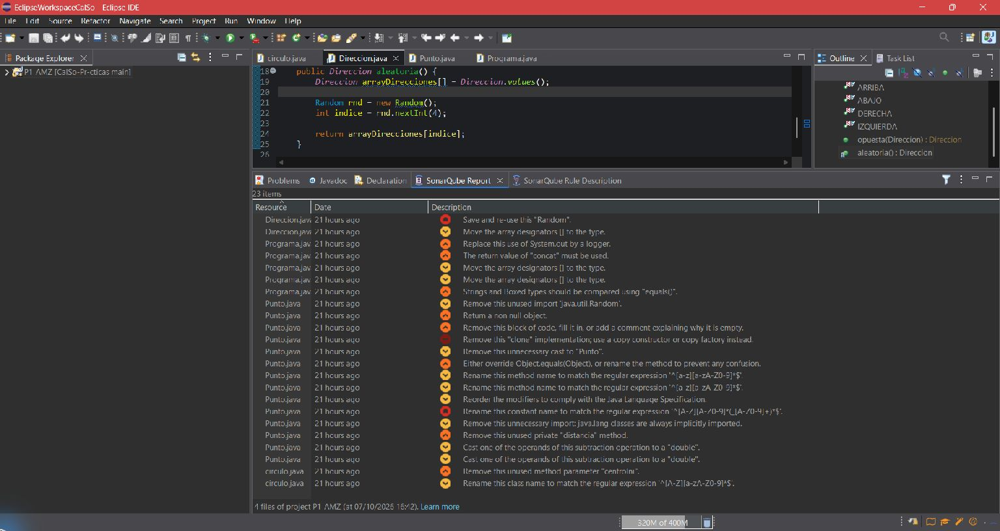

# Práctica 1 — Revisión estática de código con SonarQube for Eclipse

## 1. Miembros del grupo

| Miembro | Nombre y apellidos |
|---|---|
| Alumno 1 | Adrián Martínez Zamora |
| Alumno 2 | Pendiente de incorporación |

**Nombre provisional del proyecto Eclipse:** `P1_AMZ`

## 2. Análisis inicial

El 7 de octubre de 2026 se analizó el proyecto completo `P1_AMZ` con SonarQube for IDE 13.0 en Eclipse, en modo local independiente y con las reglas predeterminadas. Se detectaron **23 disconformidades** en cuatro archivos, antes de modificar el código Java.

## 3. Disconformidades detectadas

La tabla reproduce los avisos del análisis inicial. Las líneas corresponden al código original; pueden cambiar tras las correcciones.

| Nº | Regla Sonar | Archivo | Línea | Disconformidad |
|---:|---|---|---:|---|
| 1 | `java:S2119` | `Direccion.java` | 21 | Save and re-use this "Random". |
| 2 | `java:S1197` | `Direccion.java` | 19 | Move the array designators `[]` to the type. |
| 3 | `java:S106` | `Programa.java` | 20 | Replace this use of `System.out` by a logger. |
| 4 | `java:S2201` | `Programa.java` | 16 | The return value of `concat` must be used. |
| 5 | `java:S1197` | `Programa.java` | 10 | Move the array designators `[]` to the type. |
| 6 | `java:S1197` | `Programa.java` | 7 | Move the array designators `[]` to the type. |
| 7 | `java:S4973` | `Programa.java` | 18 | Strings and boxed types should be compared using `equals()`. |
| 8 | `java:S1128` | `Punto.java` | 4 | Remove this unused import `java.util.Random`. |
| 9 | `java:S2225` | `Punto.java` | 145 | Return a non null object. |
| 10 | `java:S108` | `Punto.java` | 143 | Remove this block of code, fill it in, or add a comment explaining why it is empty. |
| 11 | `java:S2975` | `Punto.java` | 136 | Remove this `clone` implementation; use a copy constructor or copy factory instead. |
| 12 | `java:S1905` | `Punto.java` | 130 | Remove this unnecessary cast to `Punto`. |
| 13 | `java:S1201` | `Punto.java` | 126 | Either override `Object.equals(Object)`, or rename the method to prevent any confusion. |
| 14 | `java:S100` | `Punto.java` | 82 | Rename the method to match `^[a-z][a-zA-Z0-9]*$`. |
| 15 | `java:S100` | `Punto.java` | 51 | Rename the method to match `^[a-z][a-zA-Z0-9]*$`. |
| 16 | `java:S1124` | `Punto.java` | 11 | Reorder the modifiers to comply with the Java Language Specification. |
| 17 | `java:S115` | `Punto.java` | 11 | Rename the constant to match `^[A-Z][A-Z0-9]*(_[A-Z0-9]+)*$`. |
| 18 | `java:S1128` | `Punto.java` | 3 | Remove this unnecessary import: `java.lang` classes are always implicitly imported. |
| 19 | `java:S1144` | `Punto.java` | 116 | Remove this unused private `distancia` method. |
| 20 | `java:S2184` | `Punto.java` | 117 | Cast one operand of the subtraction to `double` (coordinate X). |
| 21 | `java:S2184` | `Punto.java` | 117 | Cast one operand of the subtraction to `double` (coordinate Y). |
| 22 | `java:S1172` | `circulo.java` | 10 | Remove this unused method parameter `centroIni`. |
| 23 | `java:S101` | `circulo.java` | 3 | Rename this class to match `^[A-Z][a-zA-Z0-9]*$`. |

## 4. Soluciones adoptadas

### Disconformidad 1 — `java:S2119`

**Localización inicial:** `src/main/java/juego/geometria/Direccion.java`, línea 21.  
**Responsable:** Adrián Martínez Zamora.  
**Commit:** `P1 - S2119 - Reutilizar generador aleatorio`.

**Problema detectado.** `aleatoria()` creaba un `Random` nuevo en cada llamada, con un coste innecesario y una secuencia potencialmente menos aleatoria.

**Solución adoptada.** Se creó una única instancia `private static final Random RANDOM` en `Direccion` y el método la reutiliza. El nuevo análisis del proyecto completo mostró 22 incidencias: desapareció `java:S2119` y no aparecieron otras nuevas.

### Disconformidad 2 — `java:S1197`

**Localización inicial:** `src/main/java/juego/geometria/Direccion.java`, línea 19.  
**Responsable:** Adrián Martínez Zamora.  
**Commit:** `P1 - S1197 - Corregir declaración del arreglo de direcciones`.

**Problema detectado.** Los corchetes del arreglo estaban junto al nombre `arrayDirecciones` en lugar de junto al tipo.

**Solución adoptada.** Se cambió la declaración a `Direccion[] arrayDirecciones`. El nuevo análisis del proyecto completo mostró 21 incidencias: desapareció este aviso y no aparecieron otros nuevos.

### Disconformidad 3 — `java:S106`

**Localización inicial:** `src/main/java/juego/pruebas/Programa.java`, línea 20.  
**Responsable:** Adrián Martínez Zamora.  
**Commit:** `P1 - S106 - Sustituir salida estándar por registrador`.

**Problema detectado.** El programa escribía directamente en `System.out`, sin el control de niveles y destinos que ofrece un registrador.

**Solución adoptada.** Se incorporó un `Logger` de `java.util.logging` y se sustituyó `System.out.println(mensaje)` por `LOGGER.info(mensaje)`. El análisis completo mostró 20 incidencias, sin avisos nuevos.

### Disconformidad 4 — `java:S2201`

**Localización inicial:** `src/main/java/juego/pruebas/Programa.java`, línea 16.  
**Responsable:** Adrián Martínez Zamora.  
**Commit:** `P1 - S2201 - Conservar el resultado de la concatenación`.

**Problema detectado.** `String.concat` devuelve una cadena nueva, pero el código descartaba ese resultado. Además, el arreglo tenía una posición `null` que produciría una excepción al recorrerlo.

**Solución adoptada.** Se asigna el resultado a `info` y se ignoran los elementos `null` del arreglo antes de llamar a `toString()`. El análisis completo mostró 19 incidencias, sin avisos nuevos.

### Disconformidad 5 — `java:S1197`

**Localización inicial:** `src/main/java/juego/pruebas/Programa.java`, línea 10.  
**Responsable:** Adrián Martínez Zamora.  
**Commit:** `P1 - S1197 - Corregir declaración del arreglo de puntos`.

**Problema detectado.** Los corchetes del arreglo estaban junto al nombre `puntos`.

**Solución adoptada.** Se declaró `Punto[] puntos`. El análisis completo mostró 18 incidencias, sin avisos nuevos.

### Disconformidad 6 — `java:S1197`

**Localización inicial:** `src/main/java/juego/pruebas/Programa.java`, línea 7.  
**Responsable:** Adrián Martínez Zamora.  
**Commit:** `P1 - S1197 - Corregir declaración de argumentos`.

**Problema detectado.** `main` declaraba los argumentos como `String args[]`, con los corchetes junto al nombre de la variable.

**Solución adoptada.** Se cambió la firma a `main(String[] args)`. El análisis completo mostró 17 incidencias, sin avisos nuevos.

### Disconformidad 7 — `java:S4973`

**Localización inicial:** `src/main/java/juego/pruebas/Programa.java`, línea 18.  
**Responsable:** Adrián Martínez Zamora.  
**Commit:** `P1 - S4973 - Comprobar si la cadena está vacía`.

**Problema detectado.** `info == ""` comparaba referencias de objetos, no el contenido de la cadena.

**Solución adoptada.** Se utilizó `info.isEmpty()`, que expresa directamente la condición buscada. El análisis completo mostró 16 incidencias, sin avisos nuevos.

Las demás soluciones se incorporarán tras comprobar cada corrección.

## 5. Resumen de las correcciones

| Nº | Regla Sonar | Responsable | Commit | Resultado |
|---:|---|---|---|---|
| 1 | `java:S2119` | Adrián Martínez Zamora | `P1 - S2119 - Reutilizar generador aleatorio` | Resuelta; 23 → 22 incidencias |
| 2 | `java:S1197` | Adrián Martínez Zamora | `P1 - S1197 - Corregir declaración del arreglo de direcciones` | Resuelta; 22 → 21 incidencias |
| 3 | `java:S106` | Adrián Martínez Zamora | `P1 - S106 - Sustituir salida estándar por registrador` | Resuelta; 21 → 20 incidencias |
| 4 | `java:S2201` | Adrián Martínez Zamora | `P1 - S2201 - Conservar el resultado de la concatenación` | Resuelta; 20 → 19 incidencias |
| 5 | `java:S1197` | Adrián Martínez Zamora | `P1 - S1197 - Corregir declaración del arreglo de puntos` | Resuelta; 19 → 18 incidencias |
| 6 | `java:S1197` | Adrián Martínez Zamora | `P1 - S1197 - Corregir declaración de argumentos` | Resuelta; 18 → 17 incidencias |
| 7 | `java:S4973` | Adrián Martínez Zamora | `P1 - S4973 - Comprobar si la cadena está vacía` | Resuelta; 17 → 16 incidencias |

## 6. Análisis final

Pendiente de realizar sobre el proyecto completo y de añadir `imagenes/sonar_final.png`.

## 7. Proyecto final

El proyecto Eclipse se encuentra en `P1/proyecto/P1_AMZ/`. Su código Java aún conserva el estado de partida.

## 8. Comprobación de la entrega

- [ ] Confirmar la composición del grupo y el nombre definitivo del proyecto antes de la captura inicial.
- [x] Incorporar la captura y todas las disconformidades del análisis inicial.
- [ ] Resolver, documentar y comprobar cada disconformidad con un commit independiente cuando corresponda.
- [ ] Incorporar la captura del análisis final del mismo proyecto sin disconformidades.
- [ ] Verificar que el proyecto final compila y coincide con el analizado.
- [ ] Comprobar la autoría y la participación exigidas en el historial de `main`.
